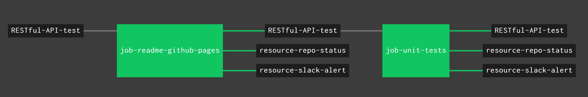

# RESTful-API-test

[](https://codeclimate.com/github/JeffDeCola/RESTful-API-test)
[](https://codeclimate.com/github/JeffDeCola/RESTful-API-test/issues)
[](https://goreportcard.com/report/jeffdecola/RESTful-API-test)
[](https://godoc.org/github.com/JeffDeCola/RESTful-API-test)
[](http://jeffdecola.mit-license.org)


`RESTful-API-test` is a very limited RESTful API in which you can GET
and POST data from a database via a CLI http client.

[GitHub Webpage](https://jeffdecola.github.io/RESTful-API-test/)

## ORIGINAL SOURCE

Written in go using gin &amp; gorp.

Original go code from [phalt](https://github.com/phalt).

## RUN

From Command line

```bash
go run main.go
```

In another terminal, use a CLI http client like httpie and you can do the following commands:

**Create New Article**

```bash
http POST localhost:8000/articles title="A simple RESTful-API-test" content="Hello-World"
```

**Query Entry List - Returns all articles in the list**

```bash
http localhost:8000/articles
```

**Query Single Resource - Get back single article via it's id**

```bash
http localhost:8000/articles/1
```

## UNIT TEST USING CONCOURSE CI

To automate unit_testing, a concourse ci pipeline is used.



A _/ci/.credentials_ file needs to be created for your _slack_url_ and _repo_github_token_.

Use fly to upload the the pipeline file _ci/pipline.yml_ to concourse:

```bash
fly -t ci set-pipeline -p RESTful-API-test -c ci/pipeline.yml --load-vars-from ci/.credentials.yml
```

## CONCOURSE RESOURCES IN PIPELINE

As seen in the pipeline diagram,`RESTful-API-test` also contains a few extra concourse resources:

* A resource (_resource-slack-alert_) uses a [docker image](https://hub.docker.com/r/cfcommunity/slack-notification-resource)
  that will notify slack on your progress.
* A resource (_resource-repo-status_) use a [docker image](https://hub.docker.com/r/dpb587/github-status-resource)
  that will update your git status for that particular commit.
* A resource ([_`resource-template`_](https://github.com/JeffDeCola/resource-template))
  that can be used as a starting point and template for creating other concourse
  ci resources.

These resources can be easily removed from the pipeline.