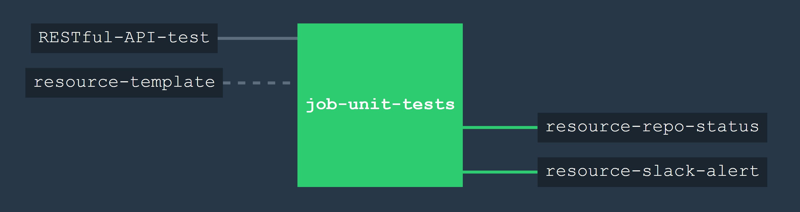

# RESTful-API-test

[](https://codeclimate.com/github/JeffDeCola/RESTful-API-test)
[](https://codeclimate.com/github/JeffDeCola/RESTful-API-test/issues)
[](http://jeffdecola.mit-license.org)
[](https://goreportcard.com/report/jeffdecola/RESTful-API-test)
[](https://godoc.org/github.com/JeffDeCola/RESTful-API-test)


`RESTful-API-test` is a very limited RESTful API in which you can GET
and POST data.

Written in go using gin &amp; gorp.

It is unit tested and built using concourse ci.

(Original Code from https://github.com/phalt)

----

## USAGE

```bash
go run main.go
```

In another terminal, use a cli http client like httpie.

### Check Body

```bash
http localhost:8000/ --body
```

### Create New Article

```bash
http POST localhost:8000/articles title="A simple API in Go" content="This is my content"
```

### Query Entry List - Returns all articles in the list

```bash
http localhost:8000/articles
```

### Query Single Resource - Get back single article via it's id

```bash
http localhost:8000/articles/1
```

## BUILT USING CONCOURSE CI

A concourse ci pipeline is used to unit test.



A /ci/.credentials file needs to be created for your slack_url and repo_github_token.

## OTHER RESOURCES IN PIPELINE

`RESTful-API-test` also contains a few extra concourse resources in the pipeline:

* A resource that will notify slack on your progress.
* A resource that will update your git status.
* A resource [`resource-template`](https://github.com/JeffDeCola/resource-template)
  that can be used as a starting point/template for creating other concourse
  ci resources.

These resources can be easily removed from the pipeline.